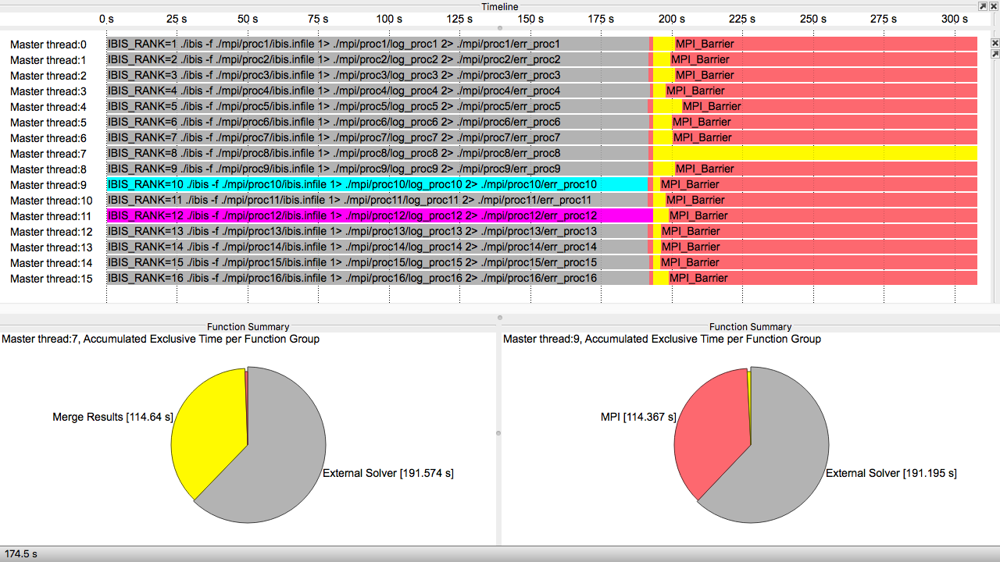

# Welcome to my software performance analysis blog
Today, software performance strongly depends on the appropriate usage of system hardware and software. 
Unfortunately, efficient software is not generated automatically by compilers in most cases.
Software needs to be tuned (manually) for optimal usage of vector registers, cache memory, multiple cores, GPU accelerators, and network interconnects.  
Without optimization, the total computational performance tends to be even lower than 1% of the theoretical peak performance.    

## Tools
There are tons of tools available that address performance debugging and analysis and I will not got into detail here.
Feel free to use whatever you think is appropriate or available in your context. 
In the end, tuning methodology tends to be very similar across all supportive tools.
I personally have a work affiliation with the tools listed at [VIRTUAL INSTITUTE – HIGH PRODUCTIVITY SUPERCOMPUTING](http://www.vi-hps.org).
This blog documents analysis examples taken from my regular work using above performance tools.
I noticed that working with performance tools is not always as easy as one would hope.
Therefore, I want to share my experiences and provide an insight into what's actually possible and how one can get there.

# Blog Posts

## Workflow analysis with Score-P and Vampir. Studying an MPI-parallel simulation program that outsources its computation to multiple parallel instances of a serial legacy solver.

_Friday 30 June 2017_

Traditionally, computer simulations tend to be monolithic programs that read a configuration file, perform the simulation, and write results to an output file.
With science domains like the life sciences, chemistry or machine learning entering the high performance computing domain this concept experiences a change towards a more workflow-like approach that involves a collection of chained (standard) solvers and components.    

Let's explore how a workflow of chained parallel and serial programs can be monitored in detail with Score-P and analyzed with the Cube and Vampir performance viewers. [Read more...](2017-06-29_ibis/main.md)
